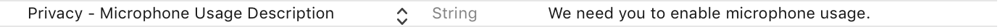

# UserVision

#### **Installation**

**Cocoapods**

[CocoaPods](http://cocoapods.org/) is a dependency manager for Cocoa projects. You can install it with the following command:

```ruby
$ gem install cocoapods
```

To integrate UserVision into your Xcode project using CocoaPods, specify it in your `Podfile`:

```ruby
source 'https://github.com/CocoaPods/Specs.git'
platform :ios, '9.0'
use_frameworks!

target '<Your Target Name>' do
  pod 'UserVision'
end
```

Then, run the following command:

```ruby
$ pod install
```

**Manually**

UserVision does not provide Dynamic Framework support yet.


## Requirement

- Swift 3.0, 3.1, 3.2, Objective C
- iOS 9.0+
- Alamofire 4.4 (If used in your project)


## Getting Started

Add **UVAuthEmail** and **UVAuthSecret** key-value pairs to your project's info.plist file.


> These fields are required and will be provided by UserVision.


Add **Privacy - Microphone Usage Description** key-value pair to project's info.plist file.



> This field is required if you're planning to record audio with UserVision.


## Usage

##### Setting Up `AppDelegate.Swift`

1. Import UserVision in your Appdelegate.swift

```swift
import UserVision
```

2. Initialize UserVision in your didFinishLaunchingWithOptions function.

Parameters:

- ptr -> UIWindow

- type -> RecordType (Optional parameter, default value is .audioScreen)

  `.screen` Records only screen without audio.

  `.audioScreen` Records screen and audio at the same time. (Recommended)

- quality -> RecordQuality (Optional parameter, default value is .mid)

  `.low` fps = 5

  `.mid` fps = 10 (Recommended)

  `.high` fps = 18

```swift
func application(_ application: UIApplication, didFinishLaunchingWithOptions launchOptions: [UIApplicationLaunchOptionsKey: Any]?) -> Bool {
        self.window = UserVision.with(rootViewController: (window?.rootViewController)!, type: .audioScreen, quality: .mid)
        return true
    }
```

3. You can optionally start UserVision in didBecomeActive and willEnterForeground functions.

```swift
func applicationDidBecomeActive(_ application: UIApplication) {
        UserVision.shared.startSession()
}
    
func applicationWillEnterForeground(_ application: UIApplication) {
        UserVision.shared.startSession()
}
```

4. You can optionally stop UserVision in didEnterBackground and willTerminate functions. 

```swift
func applicationDidEnterBackground(_ application: UIApplication) {
        UserVision.shared.stopSession()
}
    
func applicationWillTerminate(_ application: UIApplication) {
        UserVision.shared.stopSession()
}
```


##### Start Recording

```swift
UserVision.shared.startSession()
```


##### Stop Recording

```swift
UserVision.shared.stopSession()
```


## Credits

UserVision is built and maintained by [Appyist](appy.ist).


**Appyist**

Appyist develops software and designs that redefine borders on Apple platforms; trains young people by the values of culture they have created and develops a perception of quality that is assessed by the values of passion while bringing together the madly passionate ones in Turkey at monthly [TurkishKit](turkishkit.com) events.


## License

UserVision is released under the Apache License.