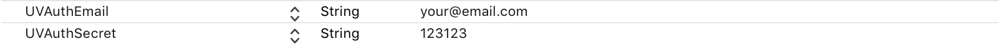

# UserVision

#### Getting Started

1. To get up and running, download UserVision from https://github.com/appyist/UserVision.git
2. Drag UserVision.framework into your Xcode project.
3. Add **UVAuthEmail** and **UVAuthSecret** key value pairs to your project's info.plist file.



> These fields will be provided by UserVision.


#### Usage

1. Import UserVision in your Appdelegate.swift

```swift
import UserVision
```

2. Initialize UserVision in your didFinishLaunchingWithOptions

Parameters:

- ptr -> UIWindow

- type -> RecordType (Optional parameter, default value is .audioScreen)

  **screen:** Records only screen without audio.

  **screenAudio:** Records screen and audio at the same time. (Recommended)

- quality -> RecordQuality (Optional parameter, default value is .mid)

  **low:** fps = 5

  **mid:** fps = 10 (Recommended)

  **high** fps = 18

```swift
func application(_ application: UIApplication, didFinishLaunchingWithOptions launchOptions: [UIApplicationLaunchOptionsKey: Any]?) -> Bool {
        UserVision.with(&window, type: .screenAudio, quality: .mid)
        return true
    }
```

3. To start recording, use startRecording().

```swift
UserVision.shared.startRecording()
```

4. To stop recording, use stopRecording().

```swift
UserVision.shared.stopRecording()
```
